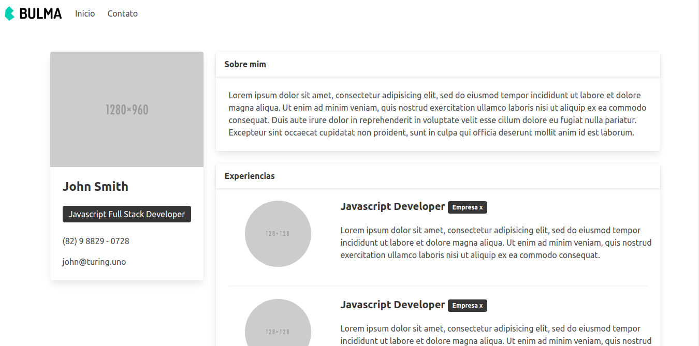

# Portfolio
O site fui criado durante o curso "Programador Full Stack Javascript" da onebitcode.

## O qué e o projeto
Se trata de um site portefólio usado para organizar melhor os projetos, experiencias e qualificações profissionais do usuário, além de trazer algumas informações sobre o desenvolvedor

## Tecnologias usadas
- HTML
- Bulma Framework

## Principais funcionalidades
### Pagina home
Nesta página e exibida algumas informações sobre o desenvolvedor, como experiencias profissionais e suas formações

## Como executa-lo
Basta clonar o projeto, ou baixar e abrir o arquivo index.html, eu seu navegador.

## Diário de bordo
### **Dia 1 - 22/07/2021**
A página inicial foi desenvolvida utilizando bulma através de um CDN.

Como boa parte da página de contato e idêntica a da página inicia eu copiei parte do código da página inicial e usei como base para desenvolver a página de contato.
